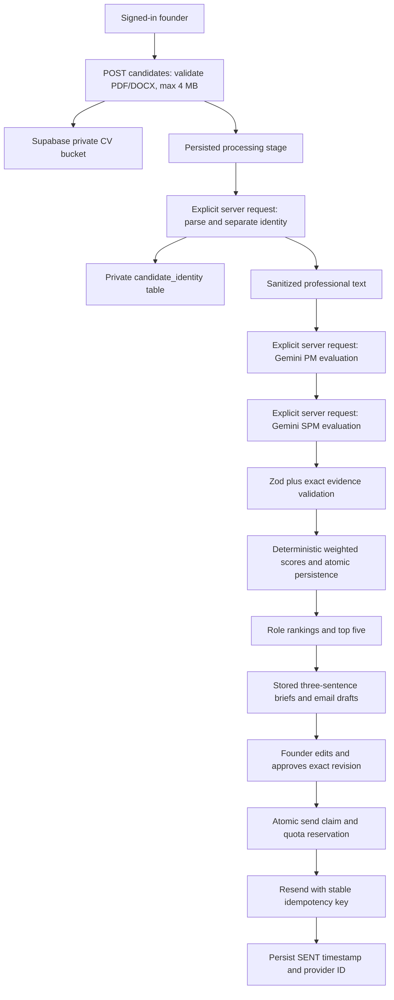

# Kargo Hiring

Live app: <https://kargo-hiring-dashboard-alpha.vercel.app> (founder sign-in only).

A founder-controlled hiring intelligence MVP for MESA Case Study 2, “Arjun and the Hiring Backlog”. Upload a PDF or DOCX once, evaluate the professional content against both historically calibrated PM and SPM rubrics, review evidence and interview briefs, then explicitly approve individual emails.

The app is login-only: `/` sends signed-out visitors to `/login`. After sign-in the founder works across Candidates, a page per candidate, Rankings, Outbox (a review queue that moves to the next draft after each decision), Upload (with step-by-step progress) and Rubrics. An empty workspace offers to add 12 synthetic sample candidates. There is no public demo mode.

## Architecture

Next.js App Router, TypeScript, Tailwind CSS, local shadcn/ui components with Radix primitives, Zod, Supabase PostgreSQL/private Storage/Auth, Gemini and Resend. One modular monolith. No workers, cron, Redis, queues, paid storage or monitoring.



The browser requests each stage in sequence (`PARSE`, `PM`, `SPM`, `FINALIZE`), rather than starting background work or polling. A persisted lease prevents overlapping requests. Failures retain the stage and allow an explicit resume from candidate detail. Each AI request times out after 45 seconds; role evaluations run in separate serverless invocations. Closing the tab stops the orchestration; the founder resumes unfinished processing manually.

## Historical-hire rubric methodology

All eight original historical hire DOCX CVs were inspected, alongside the ratings in the problem statement, answer key, component map and both job descriptions. The supplied hire files are CVs; complete interview notes and post-hire narratives were not present. A session deck was not supplied. The applications public listing exposed 50 PDF files while the problem statement describes 60.

The recurring patterns are direct operational workflow experience, independently initiated improvements adopted by real teams, and ownership through resolution and learning. Five criteria capture them. Both rubrics sum to 100, with a higher independent-ownership bar for SPM. Years of experience, titles, school prestige and identity are excluded.

Each criterion records its rationale and source hires. Weights are transparent calibration judgments, not statistically fitted predictions. Eight mixed-role examples are a small observational sample, so scores support human review and do not establish future job performance. See [the detailed methodology](docs/rubric-methodology.md), [PM v1](lib/evaluation/rubric-pm.json) and [SPM v1](lib/evaluation/rubric-spm.json).

The historical rubrics are seeded in migration `002_historical_rubrics.sql`. To change a rubric, create a new migration with a new role/version rather than overwriting historical rows. Evaluations reference their exact rubric version. A rubric upgrade requires processing candidates against both new current versions before comparing them.

## PII separation

Original CVs are stored privately. Text is extracted on the server with page boundaries for PDFs and paragraph/table text for DOCX. Name, email and phone are identified locally before any Gemini call. Name and email must be recognizable; uncertain extraction fails closed with `PII_EXTRACTION_FAILED`. Missing phone is allowed and shown as unavailable. Scanned/image PDFs produce `CV_PARSE_FAILED`; no OCR is used.

The sanitizer removes identity headers, repeated candidate-name tokens, email addresses, phone numbers, URLs (including bare domains), and personal/demographic/contact lines. It excludes entire education, references, address and personal-details sections until the next professional heading, plus standalone name/location and postal-address lines. Only sanitized text is stored in `candidate_documents.extracted_text`. Original filenames are replaced with `cv.pdf` or `cv.docx` so an identifying filename cannot enter evaluation metadata. Photographs and embedded metadata are never sent to Gemini.

This is conservative rule-based sanitization, not a guarantee of recognizing every personal entity in arbitrary prose. It can omit short employer or skill labels and rejects CVs without recognizable professional headings. Use clearly structured professional CVs; inspect unusual formats before using the live evaluation workflow. Educational institution identifiers are intentionally excluded because the rubric evaluates professional evidence.

Gemini receives candidate UUID, role, professional content and scoring criteria. Historical-hire names and criterion provenance are also stripped from the AI payload. Evaluation payload construction requires content that passed sanitization in the same request. Raw CV content, recipient details, provider bodies and credentials are not logged.

Rule-based redaction is conservative but does not prove anonymization of arbitrary prose: distinctive employers, achievements or embedded names can be identifying. Use fictional/synthetic case-study data with Gemini Free. Free-tier Gemini data handling is documented by [Google](https://ai.google.dev/gemini-api/docs/pricing); do not represent this MVP as legally certified anonymization or DPDP compliance.

## Gemini and deterministic scoring

Server-only REST requests to `gemini-2.5-flash` use JSON Schema output and Zod validation. CV text is untrusted data; the system prompt instructs Gemini to ignore embedded instructions, avoid unsupported inferences and use professional evidence only. No provider/model fallback is configured.

The response must contain exactly the rubric's criterion IDs, bounded scores from 0–10, confidence from 0–1, an exact contiguous evidence excerpt, and concise reasoning. Evidence is checked against the sanitized source ignoring only typography (case, whitespace, quote and dash styles, bullet glyphs, spacing before punctuation, a trailing full stop); an excerpt joined by an ellipsis passes only if every fragment appears in order. A criterion whose quote still cannot be found, or that the model skipped, is stored as score 0 with "Evidence unavailable" and an explanation, so unverified text is never saved or shown. Missing evidence is visibly distinguished from a weak evidenced score. Malformed outputs produce `GEMINI_INVALID_RESPONSE`.

```text
criterion contribution = (criterion score / 10) × criterion weight
overall score = sum of contributions
```

Scores are stored unrounded as PostgreSQL `numeric`; the UI rounds to one decimal place. The database independently verifies the weighted total and persists evaluations and criteria atomically. The unique `(candidate_id, role, rubric_version)` constraint reuses completed evaluations and prevents repeat evaluation charges.

Role rankings sort scores descending, then submission timestamp, then candidate UUID for stable ties. Every completely evaluated candidate is considered for both roles regardless of applied role. Top five per role, or all available candidates if fewer, are shortlisted. Invitation recipients are the union of those shortlists, so a person is contacted once. Pending draft types are reconciled when the shortlist changes; reviewed content is preserved when the draft type stays the same. Previously sent/rejected communications are never silently rewritten. The send endpoint rejects a draft whose type no longer matches the current shortlist.

Briefs use the strongest verified evidence, the matching historical pattern and a suggested interview probe, exactly three stored sentences. Briefs and professional email templates are deterministic, avoiding additional AI calls and invented claims. Candidate names are substituted locally into emails. Scores, rankings, rubric details and internal reasoning are excluded. Every draft starts `PENDING_REVIEW`.

## Database

Apply migrations in order:

1. `supabase/migrations/001_schema.sql`: candidates, identity, documents, rubrics, evaluations, criterion scores, emails, processing jobs, interview briefs and quota reservations; foreign keys, indexes, checks and atomic functions.
2. `supabase/migrations/002_historical_rubrics.sql`: versioned PM/SPM rubrics from the historical hires.
3. `supabase/migrations/003_atomic_seed.sql`: all-or-nothing synthetic demo seeding for an empty private workspace.
4. `supabase/migrations/004_auth_link.sql`: founder email-link throttling and shared email quota reservations.

All application tables enable RLS and deny anonymous/authenticated direct access. All private reads and writes pass through founder-authorized route handlers using the server-only service-role client. Security-definer RPCs are revoked from public roles and executable only by `service_role`. Tables and RPCs live in the isolated `kargo` schema; existing application tables remain untouched. Add `kargo` to exposed API schemas while preserving existing schemas. Storage bucket `kargo-candidate-cvs` is private with a 4 MB limit and PDF/DOCX MIME restrictions.

Database RPCs atomically claim processing leases, reserve AI/email quota, enforce a 100-candidate upload cap, save evaluation results, and claim email sends. Synthetic sample records can be seeded into an empty workspace from the Candidates empty state (founder-authenticated `POST /api/demo/seed`, same origin).

## Local setup

Requires Node.js 22+ and npm. No Docker or persistent backend process is needed.

```bash
npm ci
npm test
npm run typecheck
npm run lint
npm run build
npm run dev
```

The production compiler uses `next build`. On a machine that restricts Turbopack subprocess port binding, `npx next build --webpack` builds the same application. Frontend deployment verification should use Vercel preview rather than a development stack connected to real services.

## Environment variables

Set these directly in the Vercel project. Never commit values or paste keys into chat.

| Variable                        | Purpose                                                                                 |
| ------------------------------- | --------------------------------------------------------------------------------------- |
| `NEXT_PUBLIC_SUPABASE_URL`      | Supabase project URL                                                                    |
| `NEXT_PUBLIC_SUPABASE_ANON_KEY` | Supabase public anonymous key for founder authentication                                |
| `SUPABASE_SERVICE_ROLE_KEY`     | Server-only database and private storage access                                         |
| `FOUNDER_USER_ID`               | UUID of the single permitted Supabase Auth user                                         |
| `GEMINI_API_KEY`                | Server-only Gemini Developer API key                                                    |
| `GEMINI_FREE_TIER_CONFIRMED`    | Must be `true` before CVs are evaluated; operator sign-off on Gemini usage for this key |
| `RESEND_API_KEY`                | Server-only Resend key                                                                  |
| `RESEND_FROM_EMAIL`             | Verified sender, for example `Kargo <hiring@your-domain>`                               |

Create one Supabase Auth user in the dashboard, disable public sign-ups, and place its UUID in `FOUNDER_USER_ID`. Sign in at `/login`; the app opens on `/candidates`. Every private API call verifies the authenticated user with Supabase and checks the UUID. Mutations require a matching `Origin` header to prevent cross-site submissions.

## Vercel Hobby deployment

Use a personal Hobby team and a non-commercial educational demo. Vercel Hobby restricts commercial use, as described in [its plan documentation](https://vercel.com/docs/plans/hobby).

```bash
npx vercel deploy --yes
# Verify preview, then explicitly publish:
npx vercel deploy --prod --yes
```

Import the GitHub repository or deploy with the CLI, configure the environment variables in Vercel, apply the Supabase migrations in the SQL Editor or CLI, then redeploy. A 4 MB upload cap keeps multipart requests below Vercel's 4.5 MB body limit. Processing routes declare a 120-second maximum duration. No Vercel Blob, paid functions or cron are used.

## Resend setup and recovery

Use Resend Free. Verify a domain with its required SPF/DKIM records, choose a permitted sender and set both Resend variables. The test sender may only deliver to the account owner's verified address; production recipients require an appropriately verified domain. Use the case-study's MESA test recipients when processing its CVs, never assume original candidate emails are permitted external recipients.

The founder edits a draft, reviews recipient/subject/body, and confirms that exact revision. The server saves the edit, then claims the matching revision atomically. A stale approval is rejected. `SENDING` is immutable in the UI. Resend receives stable idempotency key `kargo-draft-<draft UUID>`. Success records `SENT`, `sent_at`, and provider ID. Requests cannot resend sent, rejected or in-flight drafts.

Network failures or provider acceptance followed by a database write failure remain locked as `SENDING`; no automated retry can create a duplicate after Resend's idempotency window expires. The founder must reconcile the provider record manually before an administrator changes the record. The app does not claim exactly-once delivery across two independent services.

## Free-tier limits

- Supabase Free only: 100 CVs × 4 MB bounds retained originals to 400 MB, below the advertised 1 GB Storage allowance; leave room for database/egress quotas and other apps. Use a dedicated project when possible.
- Gemini: application reservations cap 100 requests/day and 10/minute; actual model/account quotas may be lower and provider 429 responses stop processing with a clear quota error. No paid fallback or automatic retries.
- Resend: app caps 100 send reservations/day and 3,000/month. Failed/ambiguous reservations count conservatively. These limits assume the account's free allowance is not consumed by other projects; provider errors are still surfaced. Do not enable paid account overages.
- Completed evaluations, drafts and briefs are reused. Page loads never call Gemini or generate email drafts.
- No polling, background workers, scheduled jobs or extra paid services. Quota checks cannot override provider plan/account settings; the operator must keep every account on its Free/Hobby plan.
- Free Supabase projects can pause for inactivity. The app shows setup/database errors instead of falling back elsewhere.

## Verification and walkthrough

Tests exercise normal/zero/maximum/weighted scores, invalid evidence and IDs, stable ranking ties/top five, identity exclusion, PDF/DOCX fixtures, real PostgreSQL migration execution in PGlite, atomic inserts/rollback, concurrent send claims, stale approvals and quotas. PGlite stubs only the Supabase Storage metadata table and roles; it does not replace live integration verification.

One-minute walkthrough:

1. Sign in. If the workspace is empty, add the 12 sample candidates.
2. Open Rankings and switch between Product Manager and Senior Product Manager; the dashed line marks the top-five shortlist.
3. Open a candidate to read the criterion evidence and the three-sentence interview brief.
4. Open Outbox, edit a draft if needed, then Approve and send. Sample candidates use example.com addresses, so only send to an authorized test inbox.
5. Upload a fictional CV and watch it move through the four processing steps.

`node scripts/verify-deployment.mjs <url>` checks a deployment without credentials: redirects to sign-in and protected APIs.

See [deployment verification](docs/verification.md) for what was actually checked and remaining setup. A live provider workflow must not be marked complete until Supabase, Gemini and Resend are configured and verified.

Founder sign-in supports a password or a one-time email link. Create the authorized founder in Supabase Auth and configure their UUID as `FOUNDER_USER_ID` in Vercel, then redeploy. Email links are sent only when the matching founder requests one, and share the free email budget with hiring invitations.
